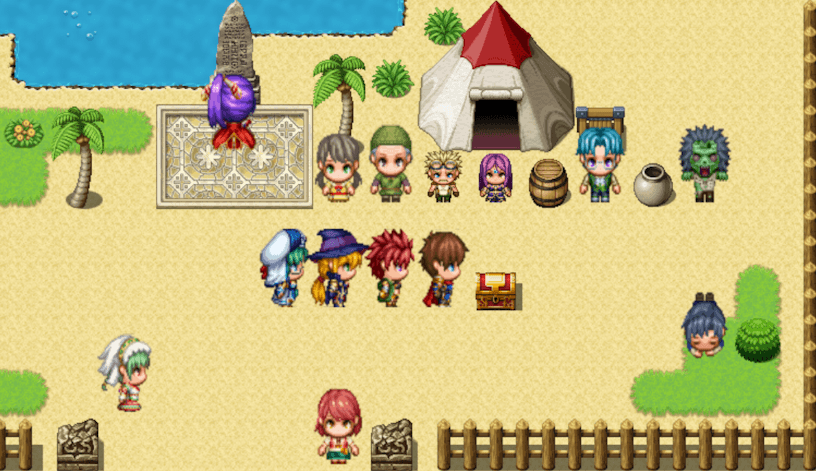
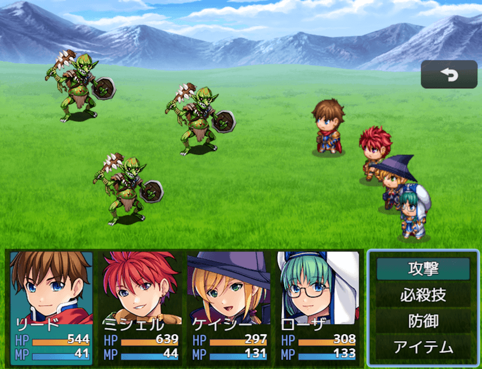

# キャラクターサイズ一括拡大プラグイン（NLM_CharacterSizeMZ.js）
### RPGツクールMZ専用プラグイン

MAPキャラクター と 戦闘SVアクター の画像サイズを一括で拡大します  
　画面解像度を高くすると、キャラが全体的に小さく感じるため作りました  
　キャラ画像の縦横比も変えられます  

パラメータで除外するキャラ画像を指定できます  
（今のところ、ファイル単位でないと指定できません）

### 注意
MAPキャラクターの当たり判定は変化せず足元にあるので、あまりサイズを大きくすると、イベントが接触しにくくなるので注意して下さい

# download

プラグインの download は、[右クリック「名前を付けてリンク先を保存」](https://raw.githubusercontent.com/nolimits-tukool/NLM_CharacterSizeMZ/refs/heads/main/NLM_CharacterSizeMZ.js)  
RPGツクールMZ専用です

# license

　MITライセンスの通りです

## [リポジトリ 一覧へ](https://github.com/nolimits-tukool?tab=repositories)
